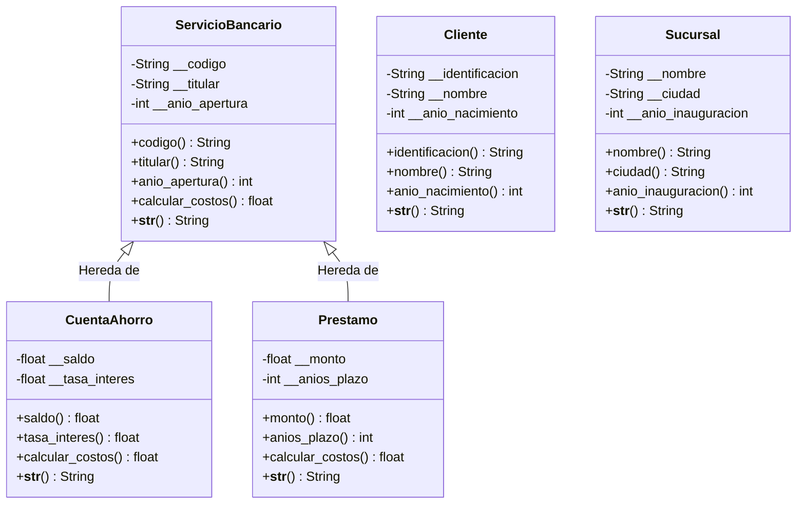

# Group4_Project
# Sistema de Gestión de Servicios Bancarios

**Integrantes:**
* Gordillo Diana
* Vidal Jostin
* Plaza Edison
* Chalen Camila

## Descripción del Proyecto
Este proyecto es una aplicación desarrollada en Python que simula la gestión básica de un sistema bancario utilizando los pilares de la **Programación Orientada a Objetos (POO)**. 

El sistema implementa:
* **Encapsulamiento:** Uso de atributos privados (ej. `__codigo`, `__saldo`) protegidos mediante decoradores `@property` (getters y setters) con validaciones de datos.
* **Herencia:** Creación de una clase padre (`ServicioBancario`) de la cual heredan clases hijas (`CuentaAhorro` y `Prestamo`) para reutilizar atributos y métodos comunes.
* **Polimorfismo:** Sobrescritura del método `calcular_costos()` en las clases hijas para aplicar lógicas de negocio distintas (mantenimiento fijo vs. porcentaje de seguro de desgravamen) dependiendo del tipo de servicio.
* **Clases Adicionales:** Modelado de entidades relacionadas como `Cliente` y `Sucursal` para complementar el ecosistema del banco.

---

## Diagrama de Clases

A continuación se presenta el diagrama estructural de las clases desarrolladas.

## Evidencias de Ejecucion

### clase_base.py

### clase_hija_1.py

### clase_hija_2.py

### clase_extra_1.py

### clase_extra_2.py

### main.py

